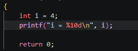
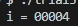

# NOTES CHAPTER 3

## 3. Formated I/O

## The `printf` function

The `printf` function is designed to return strings which can display constants, variables… It also can contain conversion specifications (%) such as `%d` or `%f` which indicate that the position where they are found if filled by the content of a variable int / float as seen in chapter 2.

Compilers aren’t required to check that a conversion specification is appropriate for the type of item being printed. If the programmer uses an incorrect specification, the program will simply produce meaningless output.

### Conversion specifications

Conversion specificators can include formmatting info → **%m.pX**

- **m** → minimum field width → specifies the minimum number of characters to
print. If the value to be printed requires fewer than m characters, the value is rightjustified within the field → extra spaces precede the value.) → When de value is negative, spaces are added to the right and the value is leftjustified.
    
    
    
    m = 10 in this case and .p is missing
    
    
    
- **X** → conversion specifier → it says if its int, float… The most common are:
- **p** → precision → It depends on the X, therefore, here are the most common specifiers:
    - *d* — Displays an integer in decimal form. p indicates the minimum
    number of digits to display (extra zeros are added to the beginning of the number if necessary); if p is omitted, it is assumed to have the value 1( %d = %.1d.)
        
        
        
        p = 5 in this case and there’s no m.
        
        
        
    - *e* — Displays a floating-point number in exponential format (scientific notation). p indicates how many digits should appear after the decimal point (the
    default is 6). If p is 0, the decimal point is not displayed.
        
        
        
        p = 5 in this case and there’s no m.
        
        
        
        
        
        p = 0 in this case, so there’s no decimal “.”.
        
        
        
    - *f* — Displays a floating-point number in “fixed decimal” format, without an
    exponent. p has the same meaning as for the *e* specifier.
        
        
        
        p = 5 in this case and there’s no m.
        
        
        
    - *g* — Displays a floating-point number in either exponential format or fixed decimal format, depending on the number’s size. p indicates the maximum number of significant digits (not digits after the decimal point) to be displayed. Unlike the *f* conversion, the *g* conversion won’t show trailing zeros. Furthermore, if the value to be printed has no digits after the decimal point, *g* doesn’t display the decimal point.
        
        
        
        p = 5 in this case, however, it returns only 4 digits
        
        
        
        
        
        p = 2 in this case, so no more than 2 digits will be shown.
        
        
        
        
        
        p = 1 in this case, so it will provide an exponential value
        
        
        

**Program to take a look and undertand each specifier:**

### Escape Sequences

The famous `\n` we used 1000 times in only 3 chapters is a perfect example of an escape sequence. When they appear in printf format strings, these escape sequences represent actions to perform upon printing (as in this case going to the next line). Here are a few common ones:

- \a → Alert bell
- \b → Backspace moving the cursor back one position
- \t → Horitzontal tab
- \ → Enabling to write “ in a text

## The `scanf`function

As `printf` prints output in a specified format, `scanf` reads input in a specified format settled by the specifiers (%d → int / %f → float). As the `printf`, the number of specifiers has to match with the number of variables and in this case, don’t forget to write the & before the variable.

`scanf` then reads the item, stopping when it encounters a character that can’t possibly belong to the item. If the item was read successfully, `scanf` continues processing the rest of the format string. If any item is not read successfully, `scanf` returns immediately without looking at the rest of the remaining input data. → Ignores white-space characters

`scanf` follows some rules to recognise the type of input we’re introducing:

- For int, first searches for a digit, a plus sign, or a minus sign; it then reads digits until it reaches a nondigit.
- For float,  it looks for a plus or minus sign (optional), followed by a series of digits (possibly containing a decimal point), followed by an exponent (optional).

Great example of this processing “thoughts” of `scanf`:

### Ordinary Characters in Format Strings

The concept of **pattern-matching** can be taken one step further by writing format strings that contain ordinary characters in addition to conversion specifications.

- **White-space characters** → The number of space characters in a format string is irrelevant, the scanf reads all until it finds a non-white-space character.
- **Other characters** →  When it encounters a non-white-space character in a format string, scanf compares it with the next input character. If the two characters match, scanf discards the input character and continues processing the format string. If the characters don’t match, scanf puts the offending character back into the input, then aborts without further processing the format string or reading characters from the input.

Ex: 

This can be used to match fractions correctly without writing them in decimal by doing a `scanf(%d/%d, &x, &y)` 

### Confusing `printf` with `scanf`

It is common to do things such as writing “,” between the %d %f… when doing a `scanf` or writing & before the variable in a `printf`. We have to be extremely careful with this errors.

- In printf, to print “%” without considering it a specifier, we have to write two %%.
- If you add only nonnumerical info in a scanf when asked to add numerical info, the variable will be undefined.

### Exercises Cap.3

