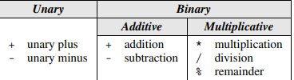

# NOTES CHAPTER 4

# 4. Expressions

C has an impressive amount of expressions:

### 4.1 Arithmetic Operators

These are the famous that can perform addition, subtraction, multiplication, and division. There are two tipes, binari, that need two statements and unari that only need one:

The only that might not look familiar is the *remainder* which states if the division is exact or not, providing 1 in 12/5 and providing 0 in 10/5.

Another thing to take into account is that binary operators can operate with int, float or either of them, normally providing a float result → 3.5f + 2 = 5.5f

We also have to we careful with the % and the / :

- When both of its operands are integers, the / operator “truncates” the result by dropping the fractional part. Thus, the value of 1 / 2 is 0, not 0.5.
- Using zero as the right operand of either / or % causes undefined behavior.
- Describing the result when / and % are used with negative operands is tricky
- The % operator requires integer operands; if either operand is not an integer, the program won’t compile.
- **Implementation-Defined Behavior** is when the C standard deliberaly leaves parts unspecified determining that the software needed to compile and this process will fill de statement and as a result, the behavior of the program may not always be the same → an example is the negative numbers with / and %. This illustrates the C’s philosophy, taking into account the efficiency of the program rather than its perfection.

#### Operator Precedence and Associativity

As all languages, C uses a stablished order to determine which operation goes first if we don’t use parantheses:

The Precedence Rules aren’t enough if the operator is at the same level of precedence. Therefore, there are the **Left Associative**  operators and the **Right Associative** ones: 

Here’s a program to practise:

### 4.2 Assignment Operators

Once the value of an expression has been computed, we’ll often need to store it in
a variable for later use and in C, an assignment is not a statement as in many other programming languages, is an operator. Thus, when assigning a value (float for example) into a variable of another type (int for example), it produces a result as in a SUM, that’s why is a Operator.

There exist **side effects,** which are refered to some operators (as =) that do not only compute the value → i = 0 produces the result “0” and stores 0 in i

The operator “=” is right associative, meaning f = (i = 33.3f)

The assignment operator, besides the fact that must of the C operators allow its operators to be variables, constants or expressions, need an **L-value** to work. An **L-value** is is an object stored in the computer memory (the ones that we only know for the moment are variables). Therefore, we can not write:

#### Compund Assignment

C’s **compound assignment** operators allow us to shorten this statement and others
like it. Using the += operator, we simply write:

Here are some compund assignments operators:

- v += e → v = v + e
- v -= e → v = v - e
- v *= e → v = v * e
- v /= e → v = v / e
- v %= e → v = v % e

### 4.3 Increment and Decrement Operators

Two of the most common operations on a variable are “incrementing” (adding 1)
and “decrementing” (subtracting 1). We can do it by writing i = i +1, by writing i -= 1 or with the increment operator ++ and  decrement operator - -. This poerators have **side efects**, because change the value of the variable forever. 

Depending on when you put them, it means one thing or another.

- Before the variable (++i), it means “increment i immidiately”
- After the variable (i++), it means “print the old value of the variable and increment it later”

### 4.4 Expression Evaluation

Here we have an example of how we have to interpret the operators.

#### Order of subespression evaluation

The rules of operator precedence and associativity allow us to break any C expression into subexpressions—to determine uniquely where the parentheses would go if the expression were fully parenthesized. Paradoxically, these rules don’t always allow us to determine the value of the expression, which may depend on the order in which its subexpressions are evaluated.

C doesn’t define the order in which subexpressions are evaluated (with the exception of subexpressions involving the logical and, logical or, conditional, and comma operators). Here we have an example: 

If the compiler evaluates first (b = a + 2), C will be 6 whether if the compiler evaluates first (a = 1), C will be 2. Therefore, always avoid writing expressions that access the value of a variable and also modify the variable elsewhere in the expression.

### 4.5 Expression Statements

Any expression can be used as an statement however, since its value is discarded afterwards, there is little point in using an expression as a statement unless it has side effects:

### Exercises Cap.4:

