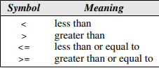

# NOTES CHAPTER 5

## 5. Selection Statements

Although C has many operators, it has few statements. So far, we encountered with the `return` statement and the expression statement. The majority of the remaining fall into 3 categories:

- **Selection statements** → The `if` and `switch` statements allow a program to select a particular execution path from a set of alternatives.
- **Iteration statements** → The `while`, `do`, and `for` support iteration (looping)
- **Jump statements** → The `break`, `continue` and `goto` statements cause an unconditional jump to some other place in the program → `Return` is part of this group.

The only ones left that are not in this classification are the *compound statement* that groups several elements into a single statement and the *null statement*, which performs an action.

This chapter discusses the selection statements and the compound statement. (Chapter 6 covers the iteration statements, the jump statements, and the null statement.)

### 5.1 Logical Expressions

Several C statements, asthe If statement, need to test the value of an expression to see if it’s “True” or “False” → In C, “True” returns a 1 and “False”, returns a 0.

#### Relational Operators

The relational operators can be used with both int and float and are left associative. Moreover, their precedence is lower than the arithmetic operators:

In C, you can not use i < j < k to compare 3 variables due to th efact of its left associativity. The program will do (i<j)<k → (1 or 0) < k.

#### Equality Operators

Like the relational operators, they return either 1 or 0 and are left associative. Hovewer, their precedence is lower that the one from the relational operators.

#### Logical Operators

! is unary, while && and | | are binary. The logical operators produce either 0 or 1 as their result. Often, the operands will have values of 0 or 1, but this isn’t a requirement; the logical operators treat any nonzero operand as a true value and any zero operand as a false value.

- `!`*expr* has the value 1 if *expr* has the value 0.
- *expr1* `&&` *expr2* has the value 1 if the values of expr1 and expr2 are both nonzero.
- *expr1* `| |` *expr2* has the value 1 if either expr1 or expr2 (or both) has a nonzero
value.
- In other cases, they produce the value 0.

Both `&&` and `||` perform “short-circuit” evaluation of their operands. That is, these operators first evaluate the left operand, then the right operand. If with the left operand we can deduce the result, the right operand isn’t evaluated.

If i = 0, the right operand isn’t evaluated

The `!` operator has the same precedence as the unary plus and minus operators. The precedence of `&&` and `||` is lower than that of the relational and equality operators and they are also left associative.

### 5.2 The `If` statement

The if statement allows a program to choose between two alternatives by testing the value of an expression.

The parenthesis are mandatory

When we execute If, the expression is evaluated and if its true (1), the statement after the parenthesis is executed.

#### Compound Statements

If we want `If` to control more than one statement;

Here’s an example: 

#### The `else` clause

The `else` statement is only executed if the `if` expression is 0. Here’s an example: 

Notice that both “inner” statements end with a semicolon. Here’s an example of a larger if and else usage: 

Adding braces to statements—even when they’re not necessary—is like using parentheses in expressions: both techniques help make a program more readable:

#### Cascaded `if` Statements

We’ll often need to test a series of conditions, stopping as soon as one of them is true. A “**cascaded**” `if` statement is often the best way to write such a series of tests → it’s just an ordinary `if` statement that happens to have another `if` statement as its `else` clause (and that `if` statement has another `if` statement as its `else` clause, *ad infinitum*).

#### The “Dangling `else`” problem

To which if statement does the `else` clause belong? The indentation suggests that it belongs to the outer if statement. However, C follows **the rule that an `else` clause belongs to the nearest if statement that hasn’t already been paired with an `else`**. In this example, the else clause actually belongs to the inner `if` statement, so a correctly indented version would look like this:

If we want the `else` to be part of the outer `if` statement, we can use {}:

#### Conditional Expressions

C’s `if` statement allows a program to perform one of two actions depending on the value of a condition. C also provides an operator that **allows an expression to produce one of two values depending on the value of a condition**.

The ***conditional operator*** consists of two symbols (? and :), which must be used together in the following way and it’s unique because it needs 3 operands:

The conditional expression `expr1 ? expr2 : expr3` should be read “if *expr1* then *expr2* else *expr3*.” The expression is evaluated in stages: *expr1* is evaluated first; if its value isn’t zero, then *expr2* is evaluated, and its value is the value of the entire conditional expression. If the value of *expr1* is zero, then the value of *expr3* is the value of the conditional.

The precedence of the conditional operator is less than that of the other operators we’ve discussed so far, with the exception of the assignment operators. They usually make programs harder to read, however, here are cases in which are tempting:

#### Boolean Values in C99

A boolean variable (int but with only 0 or 1) can be declared by writing `_Bool v;` or by including `#stdbool.h` and writing `bool v;`. Moreover, if you include a nonzero number bigger than 1, the boolean will still return a 1.

### 5.3 The `switch` Statement

Here’s a comparison between two diferent codes that can be done by `if` or by `switch`:

When this statement is executed, the value of the variable grade is tested against 4, 3, 2, 1, and 0. If it matches 4, for example, the message *Excellent* is printed, then the `break` statement transfers control to the statement following the `switch`. If the value of grade doesn’t match any of the choices listed, the default case applies, and the message *Illegal grade* is printed.

This type of statements are often easier to read than a cascade if and faster to write:

Let’s look at its components one by one:

- **Controlling expression** → The word switch must be followed by an int expression between () → float and strings don’t qualify.
- **Case labels** → Each case begins with a label case + cte expression:
- **Constant expression** → Is like an expression, but it can’t contain variables → 5 * 10 okay, i + 10 not okay.
- **Statements** → After each case label comes any number of statements and no braces are required around the statements → The last statement is usually `break`

Finally, a `switch` statement isn’t required to have a `default`. If there is no case matching, it simply passes to the next step of the program.

#### The Role of the `break` Statement

The reason that we need the `break` is to tell to the program to go out of the switch cases. If we don’t write it, the program simply falls down to the other cases as in the example:

