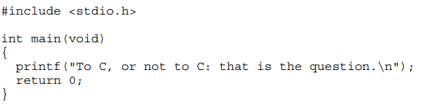

# C

# Useful resources:

https://www.youtube.com/watch?v=9UIIMBqq1D4

https://www.youtube.com/watch?v=SlqjA04_dpk

https://www.youtube.com/shorts/Fi8vnYgMiHA

- file:///D:/C%20Programming,%20A%20Modern%20Approach%20-%20Kimberly%20Nelson%20King%20-%202008.pdf
- **`o <filename>`**
    - **Description:** Specifies the name of the output executable file. If you don't use it, GCC will name your file `a.exe` (on Windows) or `a.out` (on Linux) by default.
    - **Example:** `gcc main.c -o my_program`
- **`Wall`**
    - **Description:** Enables "all" common compiler warnings. It is highly recommended to always use this because it alerts you about potential bugs, unused variables, or bad practices in your code before running it.
    - **Example:** `gcc -Wall main.c -o main`
- **`Wextra`**
    - **Description:** Enables extra warning messages that are not covered by `Wall`. Combining `Wall -Wextra` is the professional standard way to make sure your C code is perfectly clean.
    - **Example:** `gcc -Wall -Wextra main.c -o main`
- **`g`**
    - **Description:** Generates debugging information. This is crucial because it allows debugging tools (like GDB or the VS Code debugger) to inspect your code line-by-line and check variable values while it runs.
    - **Example:** `gcc -g main.c -o main`
- **`O2`**
    - **Description:** Optimizes the code for execution speed. It tells the compiler to tweak your code so the final program runs much faster and more efficiently.
    - **Example:** `gcc -O2 main.c -o main`
- **`std=<standard>`**
    - **Description:** Specifies which official C language standard version to use for compilation (such as `c99`, `c11`, or `c17`). This ensures your code complies with specific modern features.
    - **Example:** `gcc -std=c11 main.c -o main`
- **`c`**
    - **Description:** Compiles the source files into object code (generating a `.o` file) but skips the final linking stage. This is very useful when your project grows and you start splitting your code into multiple files.
    - **Example:** `gcc -c main.c`
- **`lm`**
    - **Description:** Links the math library. In C, if you use functions from the `<math.h>` header (like `pow()`, `sqrt()`, or `sin()`), you must append this flag at the very end of your command, otherwise Windows will give you a "linking error".
    - **Example:** `gcc main.c -o main -lm`

# C Programming; A Modern Approach:

***Compiler*** → A program created by sb that coverts source code (our code) into machine code (binari).

***GCC*** → GNU Compiler Collection.

***GUI (Grafical User Interface)*** → VSCode.

## 1. What type of language is C?

C is a low-type programming language → dificult readability, faster and basicaly instructions that closely correspond to the processor's instruction set, giving the programmer direct control over registers, memory, and CPU operations. 

Morever, is a language that needs to be compiled → Takes all the lines and traduces it to computer language ready to execute → The fastest type of languages used for operating systems, game engines and so on.

However, there also exist the languages that are interpreted line by line into executable code which traduces in slower execution → An example is JavaScript or Python. 

Futhermore, there are also high-type programming languages that are more readable, slower and easier to learn and write

## 2. C Fundamentals

- `#include <stdio.h>` → is necessary to “include” information about C’s standard I/O (input/output) library. → #Include is a Directive, that always begin with “#”
- `int main (void)` → Main is a function and, therefore, it returns a value. Int just indicates that is an integer value and void, indicates that main has no arguments.
- `printf \n` → Printf is a function that returns an string always between “” and \n indicates to go to the next line.
- `return 0;` → Has two effects, ends the main function and indicates that this function returns a value of 0

#### Directives

Before a C program is compiled, it is first edited by a preprocessor and commands intended for the preprocessor are the directives. #Include is a Directive, that always begin with “#” and that adds the info about C’s standard input/output library.

#### Printing Strings

We use the printf with “” to indicate the end and the start of the string. The `/n` is needed to indicate the program that we move to the next line. In order to write messages in different paragraphs, we can use it too: 

#### Comments

Comments can be introduced and ended by /* … */ or just introduced by //: 

### Variables

- ***Int*** → “*integer*” can store whole numbers such as 2, 300 or -4000 however, without any decimal points
- ***Float*** → “*floating-point*” it is used to store **decimal or fractionary numbers.

Variables must be **declared**, with a name and later a value → `int a = 5;`. You can do it simultaineously or separately:

#### Print de Value of a Variable

We can use printf, however, we need to include `%d` (int) or `%f` (float), a placeholder, to indicate where the value is shown:

#### Obtaining input from the user and saving it in a variable

In order to accomplish this, we also need to diferenciate between the 2 types of variables. However, both will use the `scanf(%  , & );`:

- scanf("%d", &i); → For int. The `%d` tells that it is a integer, the `i` is the variable in which we will introduce an int value and the `&` is necessary for scanf
- scanf("%f", &x); → For float. The ~~%f~~ tells that it is a float, the `x` is the variable in which we will introduce a float value and `&` is necessary for scanf.

To practise this, we can do a Game Stats Calculator to calculate de kill/game of the user:

---

#### Defining constants

In order to show the people who is watching our code that we have a constant, we can unse `#define name value` and

Here we have a convertor to ºC into ºF and into ºK:

#### Identifiers

An identifier is the name we choose for variables, functions, macros, and other entities and must start with letters or “_”. C is case-sensitive: it distinguishes between upper-case and lower-case letters in identifiers. There are names that can not be used for identifiers because are C functions:

### Layout of a C program

A C program can be thought as a series of tokens for each item:

A C program can have as many blank spaces as desired in order to improve its readability.

### Exercises Cap.2

